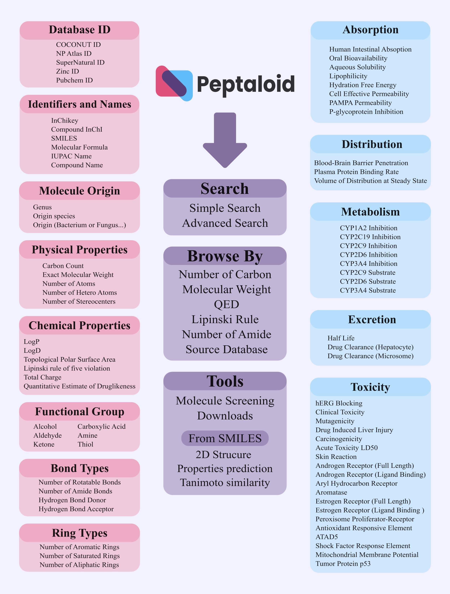

# Peptaloid Database 

Welcome to the Peptaloid Database, the first dedicated platform for exploring peptide alkaloid molecules. This React-based web interface offers researchers a powerful tool to access comprehensive data on over 161,000 peptide alkaloid compounds, aimed at facilitating drug discovery and research in pharmaceutical sciences.

## Key Features

- **Advanced Search:** Refine searches based on molecular characteristics, making exploration efficient and focused.
- **Molecular Data Visualization:** View detailed structural, physicochemical, and ADMET properties of peptide alkaloids.
- **Data Download:** Export datasets for offline analysis.
- **API Integration:** Access and manipulate data seamlessly using backend APIs.
- **Programmatic Access:** Tools for generating molecular structures, property predictions, and similarity analysis based on SMILES strings.

## Quick Start Guide

### Prerequisites

Ensure that Node.js and npm (Node Package Manager) are installed on your machine.

### Setup

1. Clone the repository.
2. Install dependencies by running `npm install` in the project directory.

### Available Scripts

- `npm start`: Runs the app in development mode. Open [http://localhost:3000](http://localhost:3000) to view it.
- `npm test`: Launches the test runner in interactive watch mode.
- `npm run build`: Bundles the app for production.
- `npm run eject`: Ejects the configuration files for full control over the build process.

For more detailed documentation on advanced configuration, code splitting, and deployment, see the [manual.md](manual.md).

## Contribution Guidelines

We welcome contributions to enhance the Peptaloid Database. Whether fixing bugs, adding features, or improving documentation, feel free to submit pull requests or open issues.

## Architecture

Figure 1: Schematic diagram for the architecture of Peptaloid database. Presents the different modules and how they interact to support comprehensive data management and analysis.

## License

This project is licensed under the MIT License - see the [LICENSE](LICENSE) file for details.
